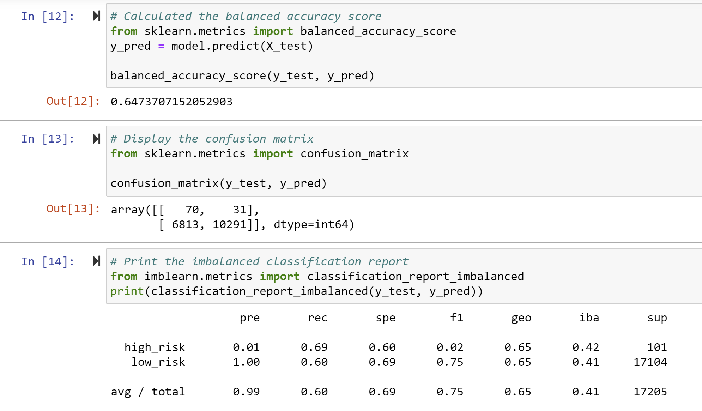
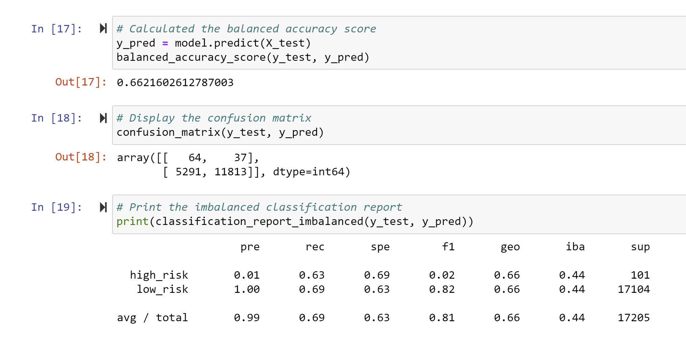
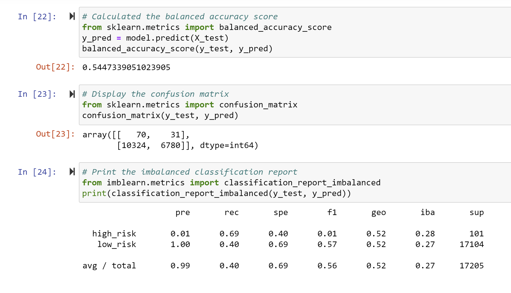
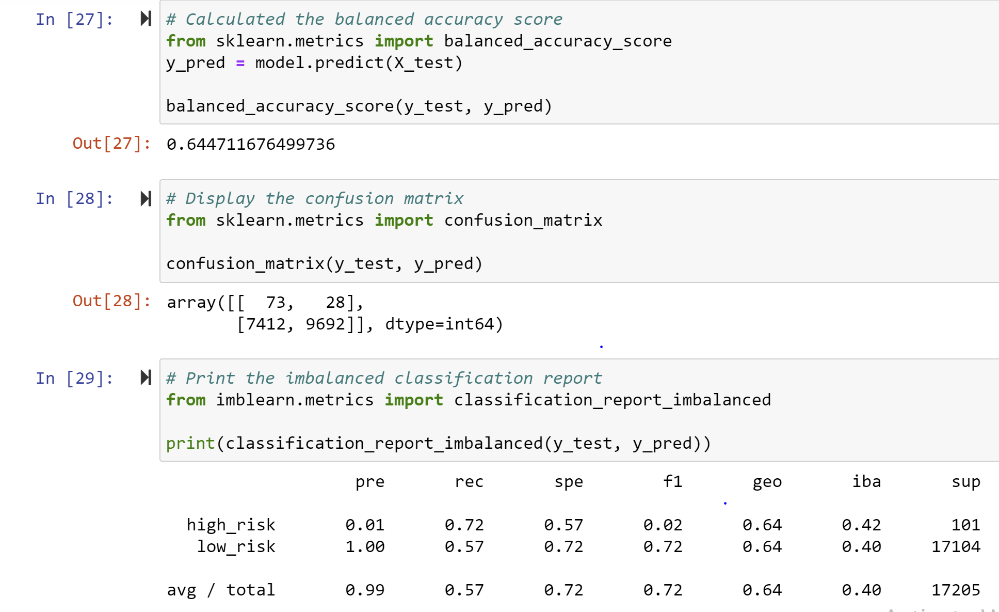
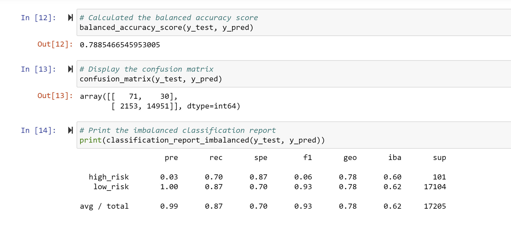
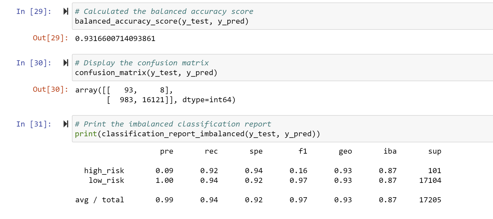

# Credit_Risk_Analysis

## Overview of the analysis:

The purpose of the analysis was to use different machine learning models to sample data. Then, to compare the performance of the different models in the accuracy of sampling unbalanaced credit risk assessment data. 

---

## Links to complete code:

---

## Results: 

Below are the balanced accuracy scores and the precision and recall scores of all six machine learning models:

### Naive Random Oversampling

* The results show that the oversampling accuracy score is quite low at 64.7%. This means that the performance of the oversampling model got only 64.7% of the predictions right. So almost 35% of the predictions were wrong. 

* Precision = TP/(TP + FP)
Precision score was 70/(70+6813)=0.01. So out of all the ones the model predicted as positive, only 70 were actually positive. only 0.01 precision. It predicted positive on many results that were not positive, meaning it said they were high risk loans but they were not high risk loans. 

* Sensitivity = TP/(TP + FN)
In terms of sensitivity or recall, 70/(70+31) =69.3%. Out of all the true positives it found only 70% of them meaning of the high risk loans it did not detect a good portion (30%) of high risk loans. 

* F1 Score or the harmonic mean:
2(Precision * Sensitivity)/(Precision + Sensitivity) was 0.02 so extremely low for high risk loans and much higher but not perfect for low risk loans at 0.75. This is the combined socre for precision and sensitivity. 

#### Image of Naive Random Oversampling code:

### SMOTE Oversampling

SMOTE oversampling had similar scores to naive random oversampling with an accuracy score of 66%, a precision score for high risk loans of 0.01 and a recall score of 0.63. Not great scores to rely on for finding high risk loans as discussed above for naive oversampling. 

#### Image for SMOTE Oversampling code:

### Undersampling

The results for undersampling were even worse with only 54.47 of the predictions being correct. The precision was 0.01 and the recall for high risk loans was 0.69 similar to oversampling. Finding many of the results as high risk loans even though they were not, and finding only 70% of the ones that were actually high risk. So missing 30% of loans that are high risk and classifying them incorrectly as low risk. 

Image for undersampling code:

### Combination (Over and Under) Sampling

Similarly, combination sampling did not perform perfectly either with an accuracy score of 64.47% with a precision score of 0.01 and a recall or sensitivity score of 0.72 for the high risk loans. 

Image for the combination over and under sampling code:

### Balanced Random Forest Classifier

This is one of two new machine learning models that reduce bias. Using this model to predict credit risk the performance of this model was better with the model predicting correctly 78.85% of the loans correctly. The precision score was 0.03 so still extremely low at finding correctly the high risk loans. But better than the other models because instead of finding between 5,000 to 10,000 false positives, this model only had a little over 2,000 false positives so not perfect but a lot better then the other models in terms of naming loans as high risk even though they were not. In terms of recall, it was 70% so similar to the other models for the high risk loans. 

#### Image for random forest classifier code:

### Easy Ensemble AdaBoost Classifier

This last model is the second new machine learning model that reduces bias. This model performed better than all the other models. It had an accuracy of 93%. So it predicted 93% of the loans correctly. The precision of predicting high risk loans was also higher at 0.09. They only found incorrectly a little less than 1,000 loans as high risk even though they were not. The recall for this model was 0.92 meaning 92% of the true high risk loans were detected which is very good to predict the vast majority of the high risk loans. 

---

## Summary: 

In summary, most models predicted the high risk loans with relatively similar accuracy. There were a large number of loans that were detected is high risk even though they were not. These same models also were not great at finding all of the high risk loans so they missed a decent percentage of loans that were in fact high risk and they were classified as not high risk. The only mmodel that performed better than all the rest was the newer machine learning model that is called the easy enseble calssifier. It had less false positives and also it found a higher percentage of the high risk loans corectly. One thing to remember when looking at accuracy is that the higher the accuracy the less general the model is. It may have an excellent fit to one dataset but may not perform as well as soon as it is used with other datasets. In this case, I would recommend using this last model since even though the percentages are high, in this scenario of finding high risk loans, it is good to find most of the high risk loans and not to find too many that are incorrectly classified as high. It would be good to test it on other datasets to confirm that it performs just as well, and that the fit is not only good specifically for this dataset. One more note, when looking at the number of features in this dataset, in the new machine learning model, there was a very long list of features and none of them were particularly dominant at predicting loan risk. The ability to predict loan risk was distributed among the long list of features. 